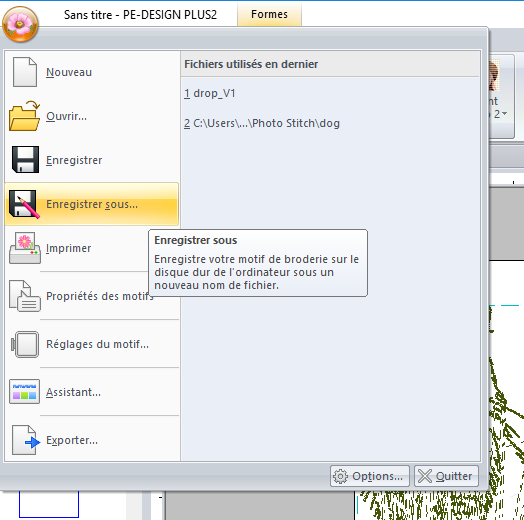

# Embroidery machine sp33d

**On how to use with almost full autonomy the embroidery machine.**

Prerequisite : being at the digital workshop.

Fabrics you can use : less than 1mm of thickness, be careful if the fabric is elastic or too thin.

## 1. Place the fabric on the frame

Take the adequat-sized frame in relation to the size of your pattern, and loosen the screw.
The default frame is the 10*10cm one.

Place the fabric on top.

Place on top the largest part of the frame.
Make sure the fabric get stuck in the most straight and tight way possible, by pulling the outside parts carefully.

Make sure both parts of the frame are well aligned and pressed against each other, so the fabric is tight on the bottom part of the frame.

Tighten the screw while keeping the fabric tight.

## 2. Placing the frame on the machine

Place the frame with the tight part of the fabric on top.

Slide the arms of the frame underneath the metal pieces of the arms of the machine.

Push the frame until both side are interlocked and until the metal buttons of the machine have clicked in the holes of the arms of the frame.

## 3. Adding a pattern via USB

**After creating a .pes pattern**

Put the USB key in the machine, on the side of the interface.

Enter the USB menu.

Select the pattern to embroider.

Click `Régler` to choose size and position.

Make sure the pattern fit the dotted lines, re-size it and/or move it if needed, then click `Broder`.

## 4. Start the embroidery

Press the locking button on the screen (if red = the machine is locked).

<!--//photo-->

Press the up arrow button ⬆️ to start the embroidery.

<!--//photo-->

To stop an ongoing embroidery, press the up arrow button ⬆️ again.

# If necessary :

## A. Creating a .pes pattern with Inkscape and Ink/Stitch

Install [Inkscape](https://inkscape.org) and the [Ink/Stitch](https://inkstitch.org/fr/) extension.

Open your image (png, jpeg, svg) with Inkscape.

If the image isn't a svg, you can do `Chemin` > `Vectoriser un objet matriciel` to turn it into a svg.

Click `Appliquer` in the window of the right, then only keep the svg by suppressing the image underneath.

Select the image and open `Extensions` > `Ink/Stitch` > `Paramètres`.

Modify the default settings if needed, and click `Apply and quit`.

Before exporting, you can preview the embroidery by opening `Extensions` > `Ink/Stitch` > `Visualiser et exporter` > `Simulateur/ Aperçu réaliste`.

To export as a .pes, save the image.

To adapt the size of the image to the size of the embrodery, you can change the size into cm ou mm:

### Creating a pattern with two or more colors:

Import a svg with multiple colors into Inkscape, and start transforming your image through `Chemin` > `Objet en chemin`.
Then, you can do the same thing than with one color : `Extensions` > `Ink/Stitch` > `Paramètres`, modify the default settings if needed, and click `Apply and quit`, and export in .pes.

*The svg image*

*The embroidery preview in Inkstitch*

*The final embroidery, not looking very good because of the quality of the fabric in relation with the stitch of the pattern*

<!--## B. Créer un motif .pes avec le logiciel PE Design

Ouvrir le logiciel PE Design.

Aller dans l'onglet `Image` puis cliquer sur `Piqûre automatique` et sélectionner l'image choisie.

Rogner le motif si besoin, puis cliquer sur `Suivant` pour lancer le calcul de conversion de l'image en motif de broderie.

Après le premier calcul de conversion, on peux changer la sensibilité de la réduction des parasites et de la segmentation pour affiner le rendu. On peux également décider du nombre de couleur max (ici : 2, le tracé et le fond), puis décider de supprimer des couleurs en cliquant dessus dans la partie `Omettre les couleurs des parties`. Ici j'ai supprimé la couleur du fond, qui est barrée.

Redimensionner le motif afin qu'il rentre dans le cadre blanc.

Pour exporter, cliquer le logo du logiciel en haut à gauche, puis `Enregistrer sous...` .

Enregistrer en format .pes.

 -->

## B. Thread the needle

**Careful : the machine must be turned off !**

Put the bobbin on the first stick, and pass the thread through the hole 1.

Then pass the thread through the hole 2, on the top of the machine, and pass it in the little angle next the small wheel.

Following the diagram, pass the thread clockwise around the wheel controlling the thread tension.

Pass the thread under the metal piece of the second small wheel.

Lower the thread along the right slit, pass it under the 4 part with the arrow, and raise it through the left slit.

Pass the thread from right to left in the hole 5, and lower it through the left slit.

Pass the thread through the hole 6 on the front of the machine.

Push the thread behind the small metal piece on the right of the needle, by pulling the thread along the needle et pushing it with the small tool.

**At this point, turn the machine on**

To thread the needle, press the `Threading the needle` button on the bottom right corner on the machine.

Two small hooks appaears on both side of the needle.
You must pull the thread under both hooks and press the button again for the hooks to pull the thread.

If one of these steps has been forgotten or done in the wrong way, the thread can be too tight or not enought, or break.

To change the color of the thread, the easiest way is to unthread the needle, then cut the thread between hole 1 and 2.
Then, place a new bobbin, pass its thread through hole 1 and tie it to the thread out of the machine before hole 2.
Finally, just pull slowly the thread after hole 6 until the knot is through.

<!-- photo !!-->

## C. Placing the spool

**Careful : the machine must be turned off !**

Place the spool with the thread clockwise in the spool container.

<!--//photo-->

Wedge the spool in its spot until you hear a click, and close the machine.

<!--//photo-->

## D. Tighten ou loosen the top thread

The top thread is too loose if the embroidery looks loose, or if the thread does loops and curls and knots during the embroidery process (the loops get tangled > the knots breaks the thread > the machine stops).

Its too tight if you can see too much of the spool thread on top of the embroidery, or if it breaks during the embroidery process.

You can tighten or loosen the thread by turning both the small top wheel on top of the machine or the big wheel just underneath it.

To tighten the thread : clockwise :

To loosen the thread : anticlockwise :

<!--//photo de broderies foirées-->

# To go further

The [Brother machine of the workshop instruction manual](https://download.brother.com/welcome/doch100509/vr_dom01eu_fr.pdf).

List of [embroidery machine tutorials](https://edutechwiki.unige.ch/fr/Catégorie:Guide_de_tutoriels_de_broderie_machine).

The comic [The Dancing Plague](https://www.selfmadehero.com/books/the-dancing-plague).
